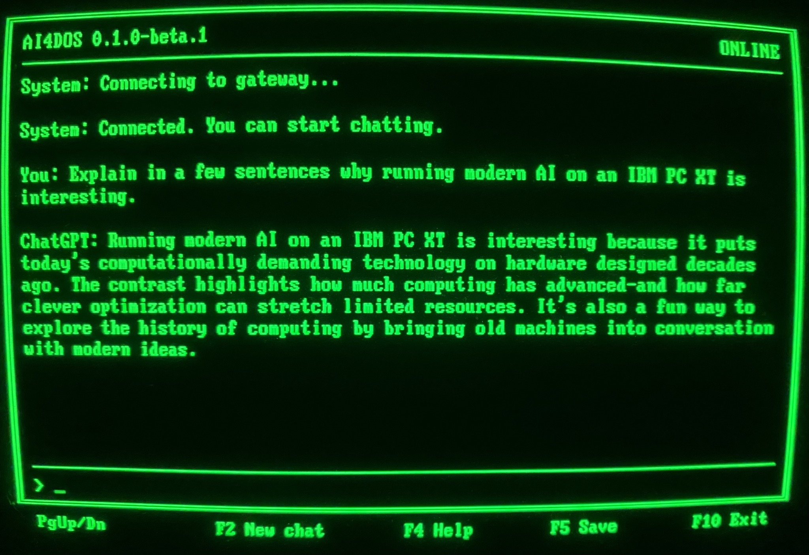
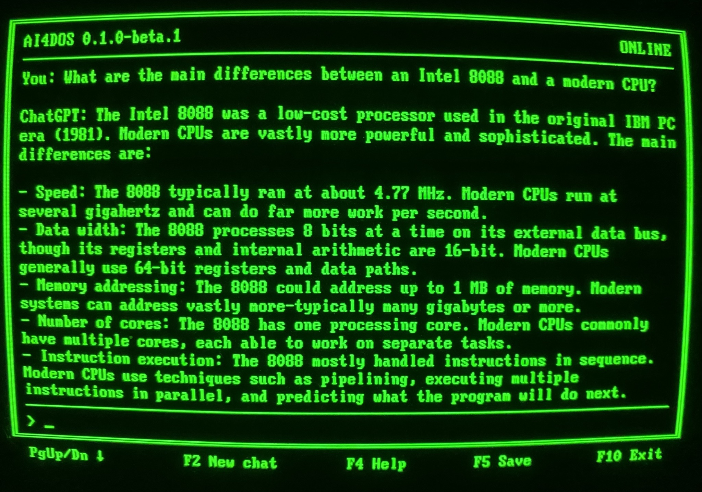
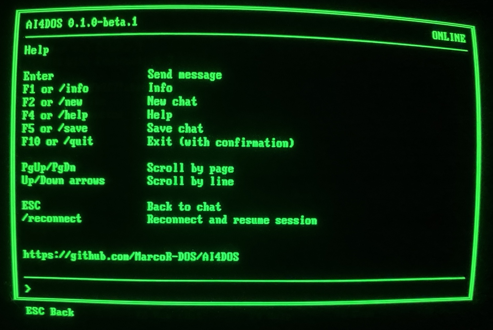

# AI4DOS

**ChatGPT, Claude, Google Gemini, Mistral and more on real DOS PCs.**

AI4DOS is a full-featured chat client for MS-DOS that connects a DOS PC to modern AI services through a lightweight gateway running on a modern computer.

It is designed for real DOS systems down to the IBM PC XT / Intel 8088 class and includes conversations, scrollback, saved chats, reconnect and session resume, multiple AI providers, German and English interfaces, DOS-friendly text rendering and secure device authentication.



*AI4DOS running on a real IBM PC XT 5160 with an IBM 5151 monochrome display.*

## Highlights

- Native 16-bit DOS executable
- IBM PC XT (Intel 8088) or compatible
- Only **256 KB of free conventional memory** required
- MDA, Hercules, CGA, EGA and VGA text modes
- CP437 and CP850 support
- English and German user interface
- Keyboard-only operation — no mouse or ANSI driver required
- Conversation history and 128-line scrollback
- Save conversations as DOS text files
- Start a new chat at any time
- Reconnect and continue the current gateway session after a connection loss
- Provider-specific chat labels such as `ChatGPT:`, `Claude:` and `Gemini:`
- DOS-friendly rendering of headings, lists, quotes, code, tables, URLs and Unicode fallbacks
- Classic Packet Driver networking with mTCP
- HMAC challenge/response authentication
- Gateway versions for Windows, macOS, Linux and Docker
- Docker Compose and Portainer support
- OpenAI / ChatGPT, Anthropic / Claude, Google Gemini, Mistral, NVIDIA, OpenRouter and OpenAI-compatible APIs
- No hard-coded model catalog — compatible model IDs can be configured directly

## How it works

A DOS PC cannot directly use the modern HTTPS/TLS connections and web APIs expected by today's AI services.

AI4DOS therefore uses a small gateway as a technical intermediary between the DOS computer and the AI provider:

```text
DOS PC  <-->  AI4DOS Gateway  <-->  AI provider
```

The gateway normally runs on an ordinary modern **PC or notebook in your local network**.

It can also run on a Mac, Linux system, Raspberry Pi, NAS, homeserver, VPS or dedicated server.

The DOS computer only needs a working Packet Driver network connection. The gateway handles the modern API side.

## Important: a subscription is not API access

Your normal ChatGPT, Claude, Gemini or other subscription login cannot be entered into AI4DOS.

AI4DOS communicates with AI providers through their **API** — a separate interface intended for third-party software. Depending on the provider, this requires a separate API key and may have its own billing or usage rules.

For an easy first test, **OpenRouter offers a free account and access to free models**, so you can try AI4DOS without immediately setting up a paid provider account.

Your provider API key stays on the modern gateway. It is never stored on the DOS PC.

## DOS client

The AI4DOS client is a native 16-bit DOS executable built for classic DOS hardware.

### User interface

- 80×25 text interface
- MDA / Hercules monochrome support
- CGA / EGA / VGA color text modes
- CP437 / CP850
- English / German
- BIOS keyboard input
- Text insertion, Delete, Backspace, Home, End and cursor movement
- PgUp / PgDn page scrolling
- Up / Down line scrolling
- Info and Help screens
- Provider-specific sender labels
- Status display:
  - `CONNECTING`
  - `ONLINE`
  - `TX/RX`
  - `ERROR`

### Chat

- New chat/session
- 128-line visual scrollback
- Separate transcript storage
- Reconnect to the gateway
- Session resume after reconnect
- Existing received text remains visible if a response is interrupted

### Saving

Chats can be saved as normal DOS text files in the `CHATS` directory.

Saved files use DOS line endings and the active DOS code page, making them readable both on the original DOS system and, with the correct encoding, on modern computers.

### Text rendering

Modern AI output is converted into a format suitable for the classic 80×25 DOS text screen.

AI4DOS handles, among other things:

- headings
- bullet and numbered lists
- quotes
- code blocks
- simple Markdown tables
- links as visible text
- common emoji fallbacks
- Unicode transliteration and replacement where needed

It is intentionally a DOS text renderer, not a full Markdown or browser engine.



*Long responses, lists and scrollback on an 8088-class DOS machine.*

## Gateway

The gateway handles provider communication, authentication and session management.

Supported provider interfaces currently include:

- OpenAI / ChatGPT
- Anthropic / Claude
- Google Gemini
- Mistral
- NVIDIA
- OpenRouter
- OpenAI-compatible APIs

AI4DOS supports **providers and APIs rather than a fixed model catalog**.

Model identifiers are normally passed to the configured provider, allowing new compatible models to be used without waiting for AI4DOS to add them to a list.

The exact model ID must be entered exactly as the respective API provider names it. Please obtain the current model name from the provider's API/developer documentation.

If you use OpenRouter for the simple free start, you can leave the prepared default value unchanged at first. OpenRouter can then choose a currently available free model. If you later want to use a specific model, enter its model ID in `MODEL=`.

Provider-specific options such as Reasoning or Thinking are handled where necessary.

### Reasoning / Thinking

AI4DOS defaults to:

```text
REASONING=none
```

This prevents optional additional reasoning modes from being enabled automatically.

Some providers and models can consume significantly more tokens when additional reasoning is enabled, which may increase API costs. AI4DOS therefore leaves such features off unless you explicitly enable them.

This does not guarantee that every model performs zero internal reasoning; some models have provider-controlled behavior that cannot be fully disabled.

## System requirements

### DOS client

**Minimum supported system:**

- IBM PC XT (Intel 8088) or compatible
- **256 KB of free conventional memory before starting AI4DOS**
- DOS
- 80×25 text display
- Packet Driver-compatible network interface
- mTCP-compatible networking

The current DOS release candidate has been tested on a real IBM PC XT 5160.

AI4DOS has network support for environments such as:

- PicoMEM
- NE2000-compatible networking solutions

Other Ethernet Packet Driver solutions may work as well, but cannot all be individually guaranteed.

### Gateway

Choose the package for the computer that will run the gateway:

- Windows
- macOS
- Linux
- Docker

Native Windows, macOS and Linux installations require **Python 3.9 or newer** and a one-time project-local `.venv` setup with the dependencies from `server/requirements-lock.txt`.

Docker and Portainer do **not** require Python to be installed on the host.

## Security and privacy

AI4DOS deliberately separates your DOS computer from your provider credentials.

- Provider API keys remain on the gateway.
- The DOS client authenticates using a separate Device Key.
- Authentication uses an HMAC-SHA256 challenge/response mechanism.
- The Device Key itself is not sent directly over the network.
- Sessions and provider requests are unavailable before successful authentication.
- Failed authentication closes the connection.
- The gateway limits unauthenticated connections and enforces an authentication timeout.
- Authentication failures can be logged in a Fail2Ban-friendly format.
- The Docker configuration runs the gateway as a restricted non-root service with hardened container settings.

### Chat traffic

**Authentication and credentials are protected. Chat messages themselves are transmitted unencrypted between the DOS client and the gateway.**

Do not use AI4DOS to exchange confidential or sensitive information across an untrusted network.

For a normal home setup, the gateway can simply run on your PC or notebook inside your local network.

If a DOS PC connects directly to a gateway on a VPS or dedicated server over the Internet, TCP port `1983` must be reachable from that DOS PC. The server should be administered like any other public network service: kept up to date, protected by a firewall and, where appropriate, Fail2Ban.

If you run the gateway on a VPS or dedicated server and do not want TCP port `1983` exposed publicly, use a VPN connection between your DOS network and the server.

## Quick Start

You need two packages:

1. the **AI4DOS DOS package**
2. the **gateway package** for Windows, macOS, Linux or Docker

Then:

1. Set up an API account with a supported AI provider.
2. Configure your provider/API key and Device Key.
3. Copy `AI4DOS.EXE` and `AI4DOS.CFG` to your DOS PC.
4. Make sure your DOS network and Packet Driver are working.
5. Run:

```dos
AI4DOS
```

→ **[Full Quick Start Guide](docs/en/quick-start.md)**



*Built-in help with keyboard shortcuts, slash commands and the project URL.*

## Documentation

Documentation: **[English](docs/en/quick-start.md)** | **[Deutsch](docs/de/quick-start.md)**

- [Quick Start](docs/en/quick-start.md)
- [Windows Gateway Setup](docs/en/install-windows.md)
- [macOS Gateway Setup](docs/en/install-macos.md)
- [Linux Gateway Setup](docs/en/install-linux.md)
- [Docker / Portainer Setup](docs/en/install-docker.md)
- [Setting up AI4DOS on DOS](docs/en/dos-setup.md)
- [Providers](docs/en/providers.md)
- [Troubleshooting](docs/en/troubleshooting.md)
- [AI4DOS Wire Protocol](protocol/README.md)

## Downloads

[Download AI4DOS - GitHub Releases](https://github.com/MarcoR-DOS/AI4DOS/releases)

AI4DOS releases are distributed as separate packages so you only download what you need:

- DOS
- Windows Gateway
- macOS Gateway
- Linux Gateway
- Docker Gateway

The release packages intentionally do not contain duplicated copies of the online documentation. The current documentation is maintained here on GitHub.

## Project status

AI4DOS is currently in **Beta**.

**Current release: `0.1.0-beta.1`**

It was developed for real DOS hardware and has been tested on real systems as well as in emulated and modern gateway environments. The project has been tested carefully wherever practical, but the variety of real DOS hardware is enormous.

During the Beta phase, feedback from users running AI4DOS on their own machines is especially valuable. I'd love to hear what hardware you used, what worked well, and where you ran into problems.

## About / History

The idea behind AI4DOS started long before AI4DOS itself existed.

Some time ago, I came across **DOSCHGPT** and was genuinely impressed by what its author had achieved: bringing modern AI interaction to DOS at all. The project stayed in the back of my mind, along with the thought that the idea could be taken much further.

Later, I wanted to bring ChatGPT to my own **IBM PC XT 5160**.

That machine has a name: **Georgi**. Its previous owner had given it that name, and after the computer came to me it quickly became much more than just another piece of retro hardware. I tend to think of it almost as a member of the family.

So the idea soon grew beyond simply putting an AI chat client on DOS.

I wanted the AI to behave as if it actually **was Georgi** — the IBM XT itself. It should know its own history, its previous owner, me, its hardware and the story behind the machine. The server therefore gained a persona and fact system alongside the DOS client.

And then the perfectionist in me took over.

What started as a personal experiment gradually became a surprisingly complete client/server project. More and more of the things I would expect from a proper chat program found their way in, along with the special features that made Georgi *Georgi*. Eventually, the project reached the point where I considered it finished.

That was when another idea came up — also encouraged by people around me:

**Why not release the technology without Georgi?**

Georgi's personality, biography and private history could stay where they belonged, while the underlying DOS client and gateway could become a neutral public project that anyone could use on their own DOS computer.

That project became **AI4DOS**.

Working on Georgi and AI4DOS turned out to be so much fun that I decided I did not want to stop there. I would like to create more new software for DOS and real retro computers, and share those projects with the community.

## Development & AI Transparency

I lead AI4DOS, including product decisions, architecture, testing, validation and release direction.

AI-assisted development tools are used for implementation work and technical problem-solving.

## Developer documentation

For source architecture, builds, providers and release maintenance, see the
[developer documentation](docs/dev/README.md).

## License

AI4DOS is licensed under the GNU General Public License v3.0 (GPL-3.0-only).

Third-party components and their respective licenses are documented in the
[third-party notices](THIRD_PARTY_NOTICES.md).
